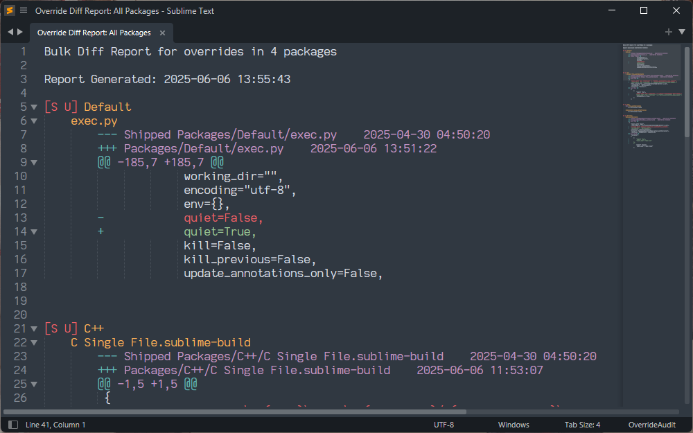
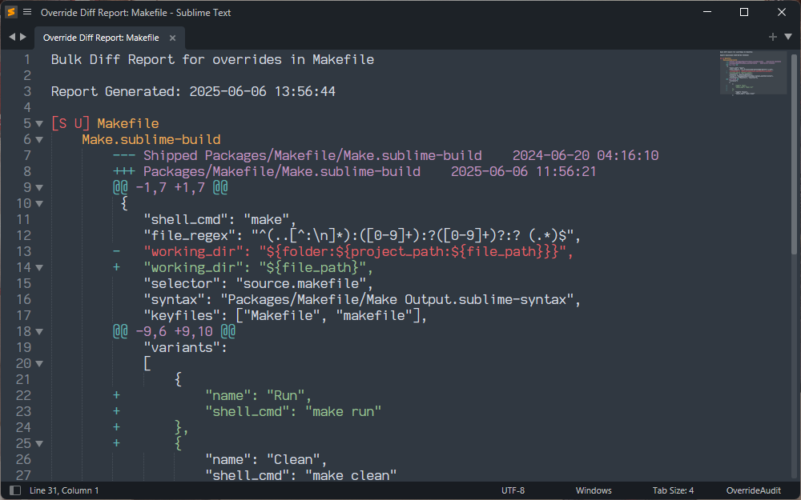
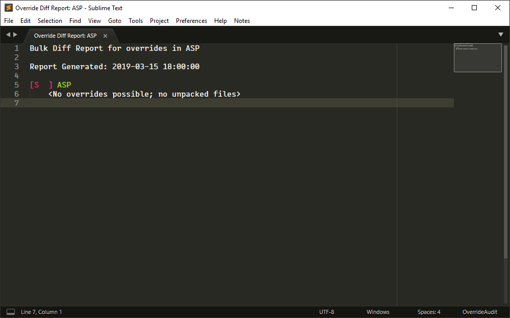

OverrideAudit allows you to easily
[create a diff of a single override](../usage/commands.md#diff-single-override)
in order to determine how you've changed the underlying file. In some cases you
may have multiple overrides at once for a package, such as when you are working
on modifications to an existing package.

For such cases, OverrideAudit allows you to create a Bulk Diff Report, which
will diff all of the overrides for a package or packages all at once. This
allows you to easily get a birds eye view of how your package is different from
the underlying version.

## Creating a Bulk Diff Report

Create a Bulk Diff report by selecting the `Tools > Override Audit > Bulk Diff`
menu item or via the
[Override Audit: Bulk Diff](../usage/commands.md#bulk-diff-report-all-packages)
from the command palette. You may also obtain a bulk diff of any package by
selecting the command from the context menu on any package name in any report.

There are two versions of this command, allowing you to create either a bulk
diff of all packages that contain overrides, or only for a
[single package](../usage/commands.md#bulk-diff-report-single-package) depending
on your needs.

When creating a bulk diff from a single package, a quick panel will be
displayed to allow you to select the package to diff. This panel will display
only those packages that currently contain overrides.

!!! NOTE

    Although OverrideAudit will tell you when a package has a
    [complete override](../terminology/index.md#complete-override) in place, it
    does not currently support creating a diff between your override package
    and the shipped package.

    This is due to the possibility that a complete override may have an
    entirely different file set than the original package, making a one to one
    file comparison impossible.

    Note however that you may still create a bulk diff report for
    [simple overrides](../terminology/index.md#simple-override) contained
    within a complete override, if any should exist.

  <figure markdown="span">
    
  </figure>
  <figure markdown="span">
    
  </figure>
  <figure markdown="span">
    
  </figure>

## Report Contents

A Bulk Diff Report is visually similar to an [Override Report](override.md); it
contains a list of all packages it has been told to diff (all packages with
overrides or just a single package) along with a list of all simple overrides
contained in those packages, if any.

Where an Override Report only indicates that an override exists, a Bulk Diff
report shows you a diff of that particular override against the version of the
file that it is overriding, allowing you to see what's different.

When the
[ignore_unknown_overrides](../config/settings.md#ignore_unknown_overrides)
setting is turned on (it is enabled by default) a Bulk Diff report will also
show [unknown overrides](../terminology/index.md#unknown-override) in the
report prefixed with a `[?]` marker to call your attention to such files. These
files will not contain any diff information (there's nothing to diff against)
but this provides a reminder to you that they exist, since other overridden
resources may or may not make reference to them.

The report uses a set level of indentation to allow code folding to quickly
fold away any overrides or packages that you see fit. This allows you to for
example fold away packages and overrides as you have looked at them, or to
systematically work your way through the report with a minimum of visual
clutter.
