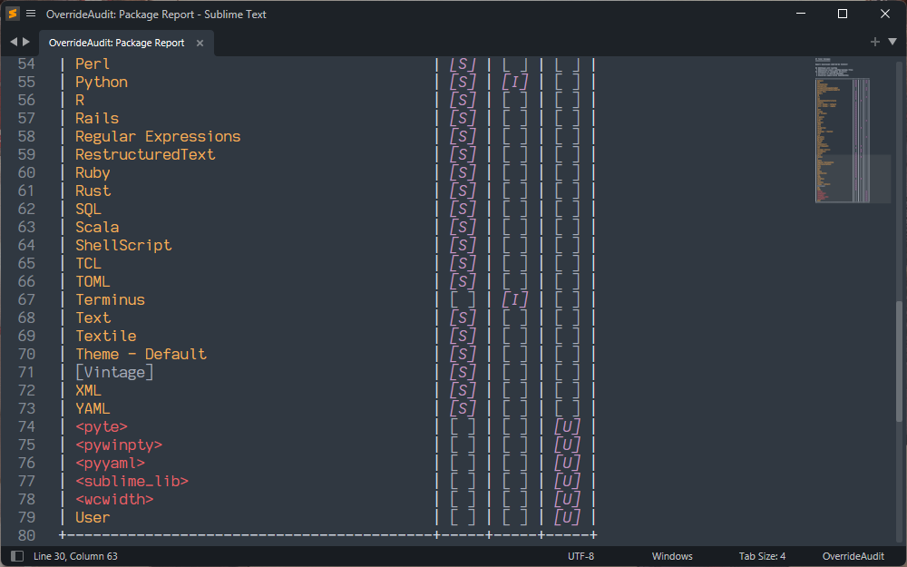

The Package Report provides you with a complete list of all packages that you
currently have installed in Sublime Text, along with extra information about
them such as:

  - Whether it is a package that ships with Sublime or was installed by you (and
    if so, how)

  - Which packages are ignored by Sublime and which are dependencies of
    installed packages

  - The relative package load order of your packages

## Creating a Package Report

Create a Package Report by selecting the `Tools > OverrideAudit > Package Report`
menu item or by selecting `OverrideAudit: Package Report` from the command
palette.

The result of this is a tabular report listing all of your installed packages
and their attributes.

  <figure markdown="span">
    
  </figure>
  <figure markdown="span">
    
  </figure>

## Report Contents

The Package Report consists of a table that lists all of the packages you
currently have installed for Sublime Text, along with a header that serves as
both a legend to tell you what the symbols in the report mean and as a count
for all packages you have installed.

Package names in the report have names reported in three different ways,
conveying extra information about that package:

  - Packages in `[Square Brackets]` are currently being ignored by Sublime Text
    because you have placed them in the `ignored_packages` list, such as the
    `Vintage` and `TypeScript` packages in the screen shot above.

  - Packages in `<Angle Brackets>` are dependency packages that are providing
    support for packages you have installed, such as `dateutils` in the screen
    shot above
  - All other packages are just normal Sublime Text packages

!!! NOTE

    As of Package Control 4, many package dependencies are installed as actual
    libraries rather than as special dependency packages. As such, you may not
    see all dependencies in the report.

Packages themselves can be represented in any or all of the following states:

  - `[S]` if this is a package that *ships* with Sublime Text by default
  - `[I]` if this is a package that you *installed* as a `sublime-package` file
  - `[U]` if this package contains *unpacked* files in the `Packages` folder.

In order to contain an override, a package must both contain `[U]`npacked files
as well as being installed as a `sublime-package` file (that is, either `[S]`hipped
with Sublime or `[I]`nstalled by you). This documentation contains a
[terminology guide](../terminology/index.md) if you are unfamiliar with these
terms as well as a page on [overrides](../terminology/overrides.md) if you are
unclear on what they are or how you would create one.

The packages in the table are listed in ***roughly*** the order that Sublime
loads them when it starts (see
[Merging and Order of Precedence](https://docs.sublimetext.io/guide/extensibility/packages.html#merging-and-order-of-precedence){: target="_blank" }
in the
[Sublime Text Community Documentation](https://docs.sublimetext.io/){: target="_blank" }
for full details).

Hovering the mouse over the name of a package in a package report (or in any
report) will show a hover popup with more information about the package, such
as it's version and description, among other details.
