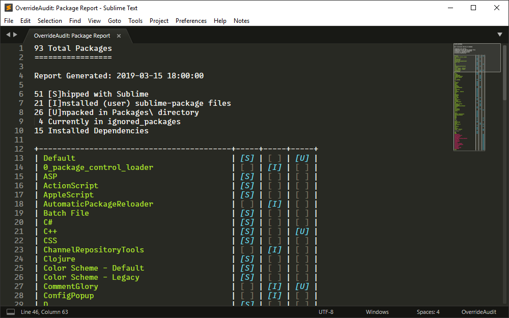
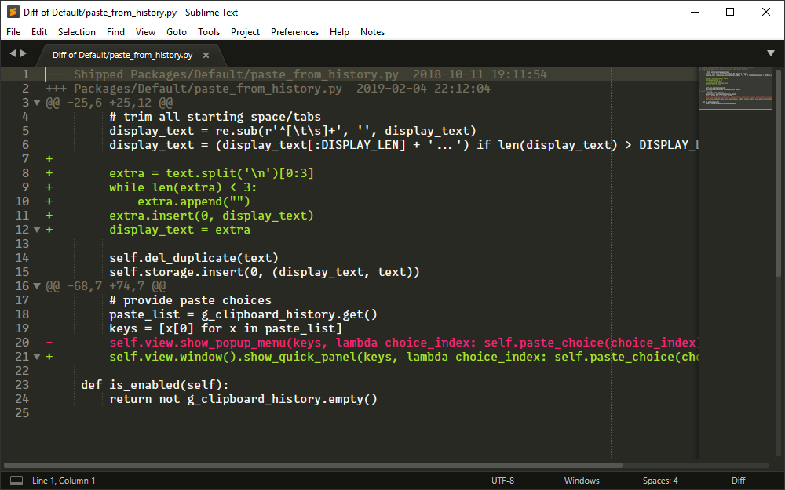

## Package Report

To get your feet wet with OverrideAudit and what it can do for you, try
creating a [Package Report](../reports/package.md). This report will give you
information on all of the packages that are currently available to Sublime
Text, with extra information for how they are installed.

Select the `Package Report` command from the command palette or from the menu in
`Tools > OverrideAudit` to bring up the report in a new tab

### Package Report Sample

  <figure markdown="span">
    
  </figure>

This report shows you a list of all packages known to Sublime, along with an
indicator that tells you whether it contains files that `[S]hip` with sublime,
were `[I]installed as a sublime-package` file, or have `[U]npacked` files.

The report shows all of the packages in roughly the order that Sublime loads
them at startup. This can help you diagnose potential conflicts among packages
that provide similar functionality (e.g. key bindings). The report also
indicates via markup any package that is in your list of ignored packages or is
a dependency package used by one of your installed packages.

OverrideAudit has many context sensitive commands available via the context
menu displayed when you ++right-button++ on text (on MacOS with a single button
mouse, this is a ++control+"click"++). Here in the Package report, try it on
one of the displayed package names as well as in the report body in general to
see what happens.

In addition, hovering the mouse over a package name in a report will display a
popup that gives you more information about that package, including its version
number, description, the dependency libraries it depends on (if any) and more.

## Override Report

Another useful report type in OverrideAudit is the
[Override Report](../reports/override.md), which lets you know on a package by
package basis what overrides you currently have defined.

There are three versions of this report; one of them shows
{{ command('Override Report', 'all overrides') }} that exist, one that shows you
only {{ command('Override Report (Only Expired)', 'expired overrides') }} and
one that shows you all overrides,
{{ command('Override Report (Exclude Unchanged)', 'filtering out unchanged files') }}.

This allows you to focus on only those overrides that may need your immediate
attention in a variety of situations. The `Expired Overrides` report is what
OverrideAudit generates for you automatically when an upgrade operation occurs
that causes some overrides to be out of date.

Create a report of this type by using the `Override Report` command as you did
for the previous report.

### Override Report Sample

  <figure markdown="span">
    
  </figure>

This report will show you all current overrides, separated out by the package
that they are defined in. Each package that is displayed shows a shortened list
of the same markers used in the `Package Report` to indicate what kind of files
this package contains.

As in that report, you can hover the mouse on the package name to see more
information on that package or use context menu items on the names of packages
and in the report body itself to take various actions. There are also context
menu operations on the names of any listed overrides.

If your report shows any overrides, try selecting the `diff` context menu item
for one of them, to see how your file is different from the one that is a part
of the package.

### Override Diff Sample

  <figure markdown="span">
    
  </figure>

From the context menu in an override diff, you can easily open your override
for editing or delete it entirely. As you might expect, from a window showing
you the contents of the override, context menu items are available to allow you
switch to the diff as well.

If you have a preferred external tool for performing diffs between files, you
can use the {{ setting("external_diff") }} setting to tell OverrideAudit about
it. In this case, the content menu in the diff will also contain an option to
open that diff in the configured external tool.

Using the {{ setting("mini_diff_underlying") }} setting, while editing an
override the diff indications in the Sublime Text gutter can be used to see
diffs inline as well, without having to open dedicated diff view.

## Next Steps

That's it for the basics of OverrideAudit! Hopefully this gives you a sense of
the functionality that the package provides to help you keep track of and
manage your overrides.

For more information what what an override is and how you would create one,
there is a complete explanation of [overrides](../terminology/overrides.md) and
how they work in Sublime Text.

For more in depth information on how OverrideAudit can help you keep Sublime
operating in tip-top shape, you can check out the OverrideAudit
[workflow](workflow.md) and [report reference](../reports/index.md) to learn
how to keep track of your overrides.

The [command list](commands.md) outlines all of the various commands in
OverrideAudit. You may also be interested in the various options available to
help you [configure](../config/settings.md) OverrideAudit to work in the way
that's best for you and your work flow.
